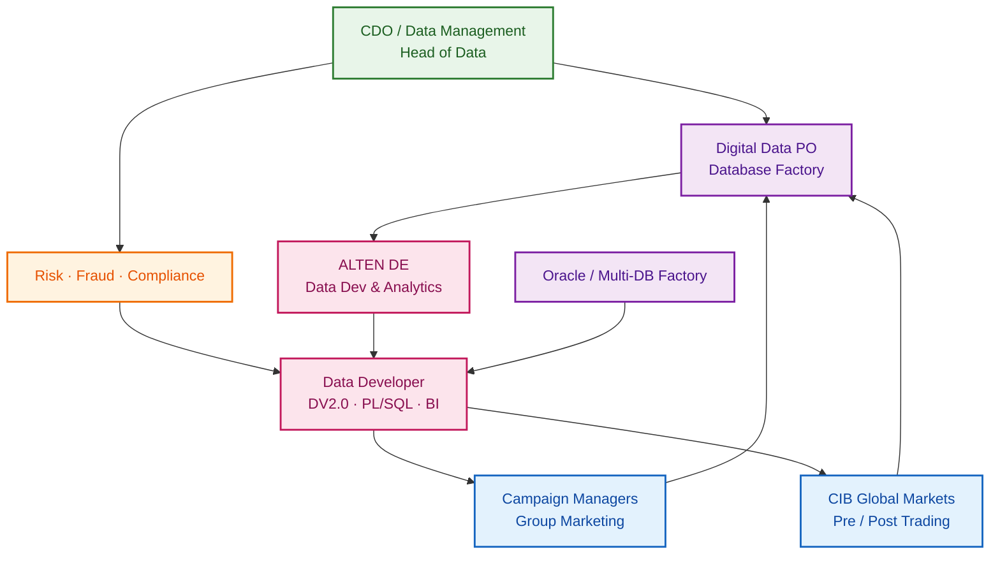
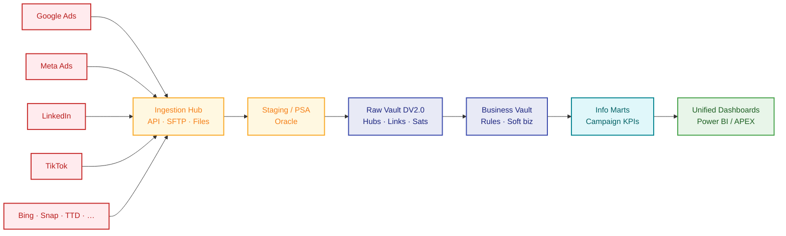
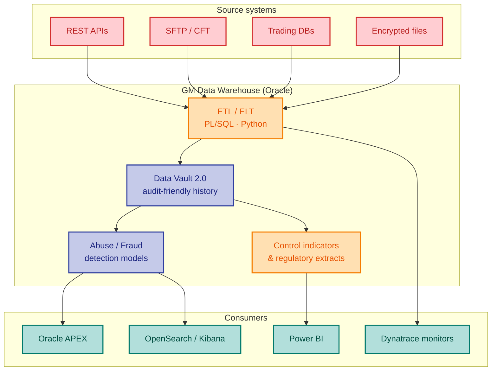
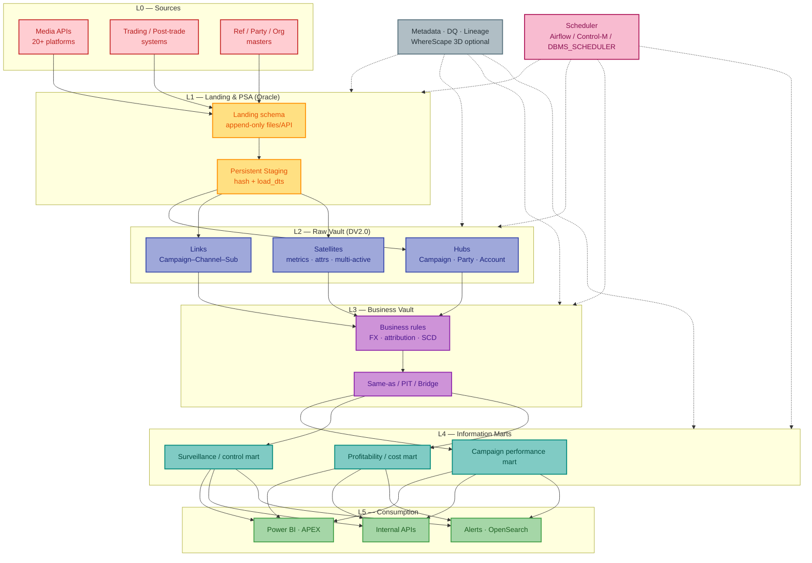
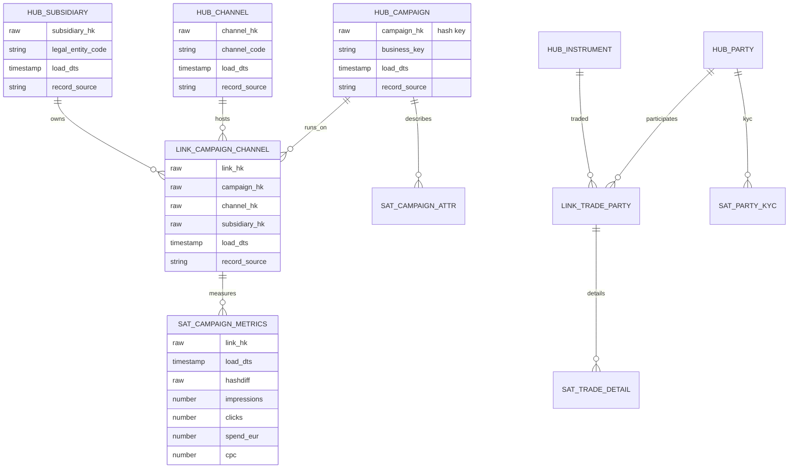
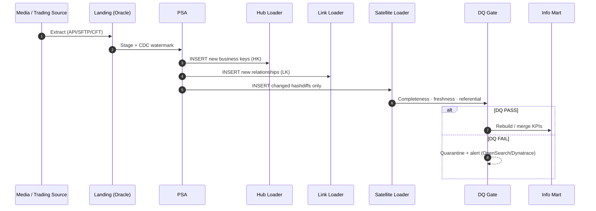
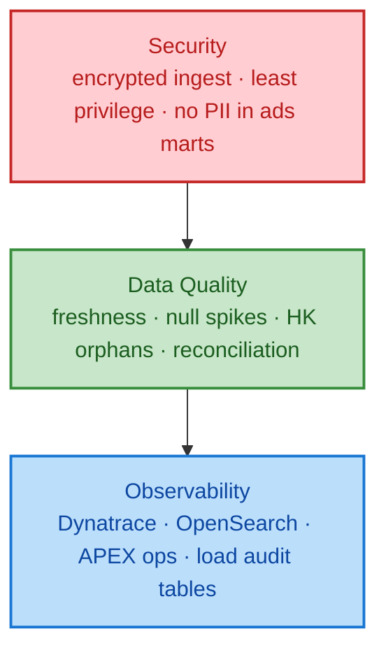
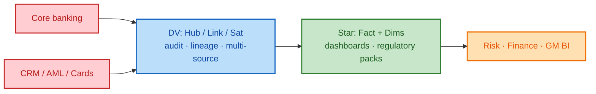
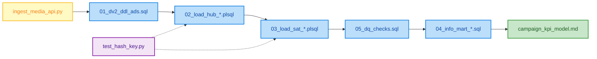

# BNP Paribas — Data Development & Advanced Analytics

**Portfolio data solution** for **ALTEN Germany → BNP Paribas** engagement: **Data Development & Advanced Analytics (1 FTE)**. Aligns with BNPP **Finance & Banking** EDWH needs — **Data Vault 2.0**, **Oracle / PL-SQL**, BI — and public domain patterns from **CIB Global Markets** warehouses plus **group advertising analytics**.

| Meta | Value |
|------|-------|
| **Client** | BNP Paribas (via ALTEN Germany) |
| **Domain** | Finance & Banking · Risk · Marketing Analytics |
| **Core stack** | Oracle EDWH · Data Vault 2.0 · PL/SQL · BI (Power BI / APEX) |
| **Nice-to-have** | WhereScape / WhereScape 3D · Enterprise DWH · Risk / Insurance |
| **Working hours** | Max overlap with **08:00–17:00 CET** (= **13:00–22:00 VNT**) |
| **Target start** | **September 2026** |

> **Disclaimer:** Educational / interview portfolio case study. No confidential BNPP data, proprietary ALTEN deliverables, or production credentials. Patterns inferred from public JDs and LinkedIn role descriptions only.

---

## Table of contents

1. [Business](#1-business)
2. [Solution design](#2-solution-design)
3. [Sample engineering code](#3-sample-engineering-code)
4. [JD mapping & interview pitch](#4-jd-mapping--interview-pitch)
5. [Repo map](#5-repo-map)

**Concepts:** [Data Vault vs Kimball in banking](docs/03-dv-vs-kimball.md) — vault integrates/historize; stars consume KPIs (both coexist).

---

## 1. Business

### 1.1 Why BNPP needs this capability

BNP Paribas operates as a **global universal bank** (Retail, CIB, Investment Partners). Analytics demand spans:

| Value stream | Business need | Data symptom today (typical) |
|--------------|---------------|------------------------------|
| **CIB Global Markets** | Pre-/post-trading controls, market-abuse surveillance, regulatory extracts | Multi-protocol feeds (REST, SFTP, CFT, DB, encrypted files) into Oracle DWH |
| **Group Marketing / Ads** | Unified campaign performance across **20+ subsidiaries** | Siloed Google / Meta / LinkedIn / TikTok / Bing / Snap / Trade Desk extracts |
| **Risk & Compliance** | Fraud / abuse detection, operational controls | Late T+1 marts; weak lineage for audit |
| **Digital Data offering** | Database Factory + Analytics platforms (Oracle, Kafka, OpenSearch, Splunk) | Productized DB/analytics services on cloud + on-prem |

**Executive one-liner:**

> *Group and CIB need one governed Enterprise Data Warehouse pattern — Data Vault 2.0 raw vault for auditability, information marts for campaign & risk KPIs, Oracle/PL-SQL for bank-grade reliability — so campaign managers and risk officers share a single source of truth.*

### 1.2 Stakeholder landscape



### 1.3 Two flagship business domains (from public BNPP roles)

#### A) Unified Advertising Analytics (Group)

- Integrate **20+ media sources**: Google Ads, Meta, LinkedIn, TikTok, Bing, Snapchat, The Trade Desk, …
- Automate **reliable, standardized ingestion** across subsidiaries
- Deliver **unified dashboards**: impressions, CPC, channel profitability — **one SSOT** for campaign managers



#### B) CIB Global Markets Pre-/Post-Trading DWH

Public role patterns (Pre-Trading / Post-Trading Data Warehouse):

| Capability | Typical work |
|------------|--------------|
| **ETL multi-protocol** | REST API, SFTP, CFT, Database, encrypted payloads → Oracle DWH |
| **Surveillance** | Market-abuse detection algorithms; high-volume performance tuning |
| **Ops tooling** | Dynatrace, Oracle APEX, OpenSearch for model/production monitoring |
| **Quality** | Non-regression + unit tests (Pytest / SQL); S3 artifacts for test data |
| **Regulatory BI** | APEX apps, Power BI, Kibana for GM activity & control indicators |



### 1.4 Pain points → outcomes

| Pain | Business impact | Target outcome |
|------|-----------------|----------------|
| Fragmented media extracts per subsidiary | No group CPC / ROI view | Unified ads info mart + dashboard |
| Opaque lineage in classic 3NF DWH | Audit / model risk findings | DV2.0 hubs/links/sats + record source |
| Late batch only | Fraud & campaign lag | Incremental loads + SLA-backed freshness |
| Manual WhereScape-less DDL sprawl | Slow EDWH change | Optional WhereScape 3D automation |
| CET / APAC collaboration friction | Handoff gaps | Clear runbooks + CET-overlap windows |

Detail: [`docs/01-business.md`](docs/01-business.md)

---

## 2. Solution design

### 2.1 Target architecture (Oracle EDWH + Data Vault 2.0)



### 2.2 Data Vault 2.0 entity map (Ads + Markets)



### 2.3 Load pattern (hash keys, incremental, audit)



### 2.4 WhereScape / EDWH acceleration (nice-to-have)


| Practice | Benefit for BNPP / ALTEN |
|----------|--------------------------|
| Model hubs/links/sats in **WhereScape 3D** | Faster EDWH design reviews with Data Management |
| Generate load procedures | Consistent HK / hashdiff / load_dts patterns |
| Keep hand-crafted PL/SQL for complex surveillance | Performance & market-abuse logic stay under DE control |

### 2.5 Operating model — CET overlap

```mermaid
gantt
    title Daily collaboration window (illustrative)
    dateFormat HH:mm
    axisFormat %H:%M

    section CET (BNPP / ALTEN DE)
    Core business hours           :active, cet, 08:00, 17:00
    Standup / design sync         :crit, sync, 09:00, 10:00

    section VNT (VN engineer)
    Overlap block                 :active, vnt, 13:00, 22:00
    Deep work / loads             :work, 14:00, 18:00
    Handoff pack to CET morning   :crit, hand, 21:00, 22:00
```



### 2.6 Security, DQ & observability



Detail: [`docs/02-solution-design.md`](docs/02-solution-design.md)

### 2.7 Data Vault vs Kimball (banking)

In a bank EDW they usually **both** exist — **different jobs**; **vault feeds the stars**.

| | **Hubs / Links / Sats (DV)** | **Star schema (Kimball)** |
|---|--------------------------------|---------------------------|
| **Job** | Integrate & historize many sources | Report KPIs fast |
| **Audience** | Data engineers, audit, risk IT | Analysts, risk / finance BI |
| **History** | Full source-aware versions | Often SCD Type 2 on dims only |



> **DV** = integration/history (*what did we know, from which source, when?*) · **Star** = consumption (*NPL, balances, CPC by day*).

Full write-up: [`docs/03-dv-vs-kimball.md`](docs/03-dv-vs-kimball.md)

---

## 3. Sample engineering code

Runnable **illustrative** artifacts (not production BNPP code):

| Path | Purpose |
|------|---------|
| [`src/sql/01_dv2_ddl_ads.sql`](src/sql/01_dv2_ddl_ads.sql) | Oracle DDL — hubs, links, satellites (Ads domain) |
| [`src/sql/02_load_hub_campaign.plsql`](src/sql/02_load_hub_campaign.plsql) | PL/SQL hub loader with hash key |
| [`src/sql/03_load_sat_metrics.plsql`](src/sql/03_load_sat_metrics.plsql) | Satellite loader (hashdiff incremental) |
| [`src/sql/04_info_mart_campaign.sql`](src/sql/04_info_mart_campaign.sql) | Campaign performance information mart |
| [`src/sql/05_dq_checks.sql`](src/sql/05_dq_checks.sql) | DQ checks — freshness, orphans, reconciliation |
| [`src/python/ingest_media_api.py`](src/python/ingest_media_api.py) | Sample multi-source media API ingest → staging |
| [`src/python/test_hash_key.py`](src/python/test_hash_key.py) | Pytest for HK / hashdiff helpers |
| [`src/bi/campaign_kpi_model.md`](src/bi/campaign_kpi_model.md) | BI semantic model notes (Power BI / APEX) |

### 3.1 Engineering flow (code map)



### 3.2 Hash key convention (shared by SQL + Python)

```text
HK  = SHA256( UPPER(TRIM(business_key)) || '|' || record_source_system )
HD  = SHA256( concatenated descriptive attributes in stable column order )
Load metadata: LOAD_DTS, RECORD_SOURCE, BATCH_ID
```

---

## 4. JD mapping & interview pitch

| JD requirement | How this solution demonstrates it |
|----------------|-----------------------------------|
| **Data Vault 2.0 (≥2y in last 3y)** | Full raw vault + loaders + PIT-ready sats for Ads & Trade |
| **Oracle / PL-SQL** | DDL + package-style loaders + mart SQL |
| **Data warehouse / BI** | EDWH layers L0–L5 + Power BI / APEX semantic notes |
| **WhereScape (nice)** | Explicit 3D → RED → Oracle acceleration path |
| **Risk / Finance / Insurance (nice)** | GM surveillance mart + control indicators |
| **ENG + CET overlap** | Docs in English; operating model gantt for 13–22 VNT |

**30-second pitch:**

> *I design Oracle Enterprise DWH with Data Vault 2.0 so BNPP can unify subsidiary campaign metrics and CIB control data with full audit lineage. I implement PL/SQL loaders, DQ gates, and BI marts, and can accelerate delivery with WhereScape when the factory standard calls for it — available September 2026 with strong CET overlap.*

Prep notes: [`prep/interview-pitch.md`](prep/interview-pitch.md)

---

## 5. Repo map

```text
bnpp-alten-data-solution/
├── README.md                          ← you are here (Business · Design · Code)
├── docs/
│   ├── 01-business.md
│   ├── 02-solution-design.md
│   └── 03-dv-vs-kimball.md            ← DV hubs/links/sats vs star schema
├── src/
│   ├── sql/                           ← Oracle DV2.0 + marts + DQ
│   ├── python/                        ← ingest + pytest
│   └── bi/                            ← KPI model notes
├── prep/
│   └── interview-pitch.md
└── .gitignore
```

---

## License / use

Portfolio & interview preparation only. Not affiliated with BNP Paribas or ALTEN. Do not deploy against real bank systems without formal engagement and security clearance.
