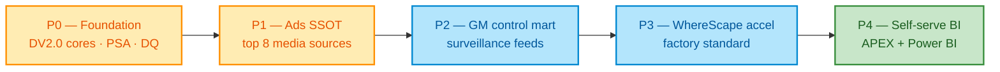

# Business context — BNP Paribas (ALTEN engagement)

## 1. Engagement framing

| Item | Detail |
|------|--------|
| Contracting | ALTEN Germany → BNP Paribas |
| Role | Data Development & Advanced Analytics (1 FTE) |
| Domain | Finance & Banking; risk / controls; marketing analytics |
| Start | September 2026 |
| Hours | Maximize overlap with 08:00–17:00 CET (13:00–22:00 VNT) |

## 2. BNPP data landscape (public patterns)

### 2.1 Group advertising analytics

Public LinkedIn-style descriptions describe a **unified advertising analytics platform** across subsidiaries:

- Centralize campaign performance reporting at **group** level
- Integrate **20+ media sources** (Google Ads, Meta, LinkedIn, TikTok, Bing, Snapchat, The Trade Desk, …)
- Automate standardized ingestion
- Deliver SSOT dashboards: impressions, CPC, channel profitability

**Business value:** marketing leadership stops reconciling 20 Excel exports; finance can attribute media spend to legal entities consistently.

### 2.2 CIB Global Markets DWH

Public GM IT roles (Pre-Trading / Post-Trading Data Warehouse) emphasize:

- ETL across REST, SFTP, CFT, databases, encrypted files
- Linux + Python + DevSecOps monitoring around surveillance models
- Market-abuse detection at high volume
- Pytest / non-regression; S3 for test artifacts
- Ops UX: Dynatrace, Oracle APEX, OpenSearch
- Regulatory / control indicators for GM managers (APEX, Power BI, Kibana)

### 2.3 Platform / Database Factory

Adjacent BNPP Digital Data offering (manager/PO profiles):

- Database products on cloud: Oracle, SQL Server, Sybase, PostgreSQL, MongoDB
- Analytics support: ElasticSearch / OpenSearch, Kafka, Splunk
- Data agility: Delphix
- Classic Oracle DBA estate (RAC, Data Guard, Exadata, EM Cloud)

**Implication for the FTE:** the developer works **inside bank-grade Oracle EDWH norms**, not a greenfield startup lakehouse — DV2.0 + PL/SQL + BI fit the culture.

## 3. Personas & jobs-to-be-done

| Persona | JTBD | Success metric |
|---------|------|----------------|
| Campaign manager (subsidiary) | See spend / CPC vs peers | Dashboard freshness &lt; 4h |
| Group marketing lead | Compare channel ROI across entities | One reconciled mart |
| GM risk / surveillance analyst | Investigate abuse signals | Lineage to source trade |
| Data Management / PO | Govern EDWH change | Documented DV objects |
| ALTEN delivery lead | Predictable delivery | Sprint burndown + DQ green |

## 4. Capability roadmap (business view)

## 5. Risks & constraints (business)

| Risk | Mitigation |
|------|------------|
| Media API rate limits / schema drift | Contract tests + flexible satellites |
| Cross-subsidiary privacy / marketing PII | Pseudonymize; no end-customer PII in ads marts |
| CET timezone handoffs | Written runbooks; overlap standup |
| Over-claiming WhereScape if unused | Offer as optional accelerator, not mandatory |

## 6. Success criteria (engagement)

1. Raw Vault live for agreed hubs/links/sats with full `RECORD_SOURCE` / `LOAD_DTS`
2. At least one **unified campaign** information mart consumed by BI
3. DQ dashboard: freshness, orphan HKs, source-vs-mart reconciliation
4. Knowledge transfer pack for ALTEN / BNPP Data Management
