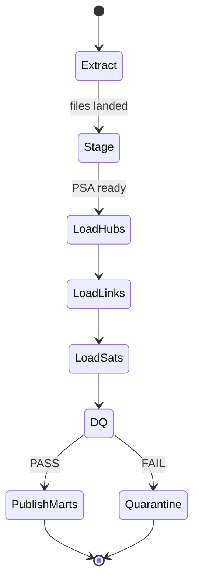

# Solution design — Oracle EDWH + Data Vault 2.0

## 1. Design principles

1. **Audit first** — every fact carries `LOAD_DTS`, `RECORD_SOURCE`, and hash keys
2. **Separate concerns** — Raw Vault (history) ≠ Business Vault (rules) ≠ Info Marts (consumer shapes)
3. **Oracle-native** — PL/SQL loaders; optional WhereScape for generation
4. **Incremental by default** — hashdiff satellites; watermark-based extracts
5. **DQ before publish** — marts refresh only after gates pass

## 2. Layer contracts

| Layer | Schema (example) | Contents | Retention |
|-------|------------------|----------|-----------|
| Landing | `LD_ADS`, `LD_GM` | Raw API JSON / files as-is | Short (7–30d) |
| PSA | `PSA_ADS`, `PSA_GM` | Flattened + CDC columns | Medium |
| Raw Vault | `RV` | Hubs, Links, Satellites | Long / regulatory |
| Business Vault | `BV` | Same-as, PIT, computed sats | Long |
| Info Mart | `IM` | Dim/fact or wide KPI tables | Per SLA |
| Audit | `AUD` | Batch log, DQ results | Long |

## 3. Naming conventions

```text
HUB_<BUSINESS_CONCEPT>          e.g. HUB_CAMPAIGN
LINK_<A>_<B>[_<C>]              e.g. LINK_CAMPAIGN_CHANNEL
SAT_<PARENT>_<CONTEXT>          e.g. SAT_CAMPAIGN_METRICS
HK column: <concept>_HK         RAW(32) SHA-256
Link HK:   LINK_HK
Satellite: HASHDIFF RAW(32)
```

## 4. Key algorithms

### 4.1 Business key → Hub hash

```text
campaign_hk = SHA256( UPPER(TRIM(campaign_bk)) || '|' || 'GOOGLE_ADS' )
```

Same natural key from two sources → **two hubs rows only if BK differs**; prefer **same-as link** in BV when identity resolution is needed across subsidiaries.

### 4.2 Satellite hashdiff

Concatenate descriptive attributes in **fixed column order**, null-safe sentinel (`?`), then SHA-256. Insert satellite row **only when hashdiff changes**.

### 4.3 Multi-active satellites

For concurrent metric grains (e.g. device × country), include grain keys in the satellite primary key alongside `LOAD_DTS`.

## 5. Ads domain — object list (MVP)

| Object | Type | Business keys / parents |
|--------|------|-------------------------|
| `HUB_CAMPAIGN` | Hub | `campaign_bk` |
| `HUB_CHANNEL` | Hub | `channel_code` |
| `HUB_SUBSIDIARY` | Hub | `legal_entity_code` |
| `LINK_CAMPAIGN_CHANNEL` | Link | campaign + channel + subsidiary |
| `SAT_CAMPAIGN_ATTR` | Sat on Hub | name, status, objective |
| `SAT_CAMPAIGN_METRICS` | Sat on Link | impressions, clicks, spend, cpc |
| `SAT_CHANNEL_ATTR` | Sat on Hub | platform family, pricing model |

## 6. GM domain — object list (illustrative)

| Object | Type | Notes |
|--------|------|-------|
| `HUB_PARTY` | Hub | Counterparty / desk |
| `HUB_INSTRUMENT` | Hub | ISIN / internal id |
| `LINK_TRADE_PARTY` | Link | Trade participation |
| `SAT_TRADE_DETAIL` | Sat | Notional, price, venue |
| `SAT_PARTY_KYC` | Sat | Risk attributes (restricted) |
| `SAT_SURVEILLANCE_FLAG` | BV sat | Model output + version |

## 7. Orchestration



Suggested tools: Oracle `DBMS_SCHEDULER`, Control-M, or Airflow calling PL/SQL entry points.

## 8. WhereScape integration (optional)

1. Import source models into **WhereScape 3D**
2. Design DV entities visually; review with Data Management
3. Generate DDL + load templates via **WhereScape RED**
4. Override complex surveillance / attribution procedures in hand-written packages

## 9. Non-functional targets (illustrative SLAs)

| Metric | Ads | GM controls |
|--------|-----|-------------|
| Freshness | ≤ 4 hours | ≤ 1 hour critical feeds |
| Completeness | ≥ 99% expected rows | ≥ 99.9% |
| Orphan links | 0 | 0 |
| Mart publish | after DQ green | after DQ green |

## 10. Reference diagrams

See main [README — Solution design](../README.md#2-solution-design) for colored architecture, ER, sequence, and CET gantt diagrams.
