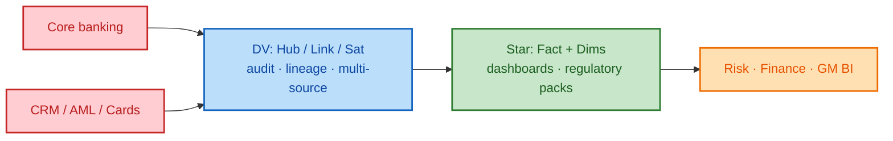

# Data Vault vs Kimball (star schema) in banking

In banking EDW they usually **both** exist — **different jobs**. You do not pick one instead of the other: **vault feeds the stars**.

## Side-by-side

| | **Hubs / Links / Sats (Data Vault)** | **Star schema (Kimball)** |
|---|--------------------------------------|---------------------------|
| **Job** | Integrate & historize many sources | Report KPIs fast |
| **Audience** | Data engineers, audit, risk IT | Analysts, risk / finance BI |
| **Change** | Add sat / source without redesigning marts | Change dims / facts when report grain changes |
| **History** | Full source-aware versions (`load_dts`, `record_source`) | Often SCD Type 2 on dims only |
| **Example** | `HUB_CUSTOMER` + `LINK_CUSTOMER_ACCOUNT` + sats from core, CRM, AML | `Fact_Transaction` + `Dim_Customer` + `Dim_Account` + `Dim_Date` |

## Flow in a bank EDW



## Banking rule of thumb

| Pattern | One-liner |
|---------|-----------|
| **DV** | System of **integration / history** — *what did we know, from which source, when?* |
| **Star** | System of **consumption** — *NPL, balances, campaign CPC by day* |

```text
DV    = HOW you model integrated history (hubs / links / sats)
Star  = HOW you present metrics for BI (facts / dims)
```

## DV core logic (quick)


```text
HUB  = unique business key            (Customer, Campaign)
LINK = relationship between hubs      (Customer–Account)
SAT  = descriptive history on hub/link (name, status, metrics)

Keys & relationships stay stable;
changing attributes version in satellites with load_dts + record_source.
```

## How this maps in this repo

| Layer in solution | Pattern |
|-------------------|---------|
| PSA / Landing | Source-shaped staging |
| `RV` hubs / links / sats | **Data Vault** (integration) |
| `IM` views / campaign marts | **Kimball-style** consumption (wide KPI / star-ready) |
| Power BI / APEX | BI on top of stars / marts |

See also: [Solution design](02-solution-design.md) · sample mart [`src/sql/04_info_mart_campaign.sql`](../src/sql/04_info_mart_campaign.sql)
