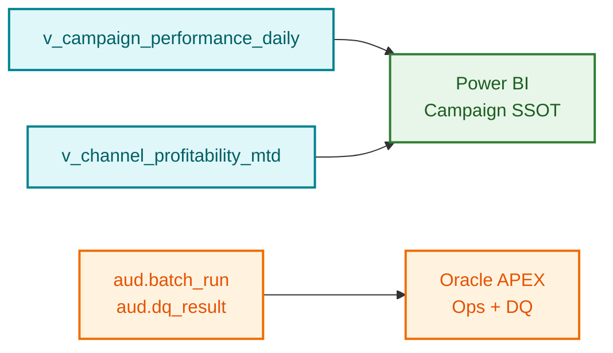

# Campaign KPI semantic model (Power BI / Oracle APEX)

Illustrative star shape over `IM` views — keeps BI simple while history lives in DV2.0.

## Tables / views

| Object | Role | Grain |
|--------|------|-------|
| `im.v_campaign_performance_daily` | Fact-like wide table | subsidiary × channel × campaign × date |
| `im.v_channel_profitability_mtd` | Aggregate | subsidiary × channel × month |

## Measures

| Measure | Expression (conceptual) | Use |
|---------|-------------------------|-----|
| Impressions | `SUM(impressions)` | Reach |
| Clicks | `SUM(clicks)` | Engagement |
| Spend EUR | `SUM(spend_eur)` | Cost |
| CPC | `Spend / Clicks` | Efficiency |
| CTR | `Clicks / Impressions` | Creative quality |
| Channel ROI proxy | `(attributed_revenue - spend) / spend` | Needs finance feed (phase 2) |

## Slicers / dimensions

- Subsidiary (`legal_entity_code`)
- Channel (`GOOGLE_ADS`, `META_ADS`, …)
- Campaign status / objective
- Date hierarchy (day → month → quarter)

## APEX ops page (suggested)

1. Batch run status from `aud.batch_run`
2. DQ traffic lights from `aud.dq_result`
3. Drill to failed `check_id` + quarantine counts

## Row-level security (conceptual)

Map Power BI / APEX roles to `subsidiary_code` so local campaign managers only see their legal entity, while group marketing sees all.
